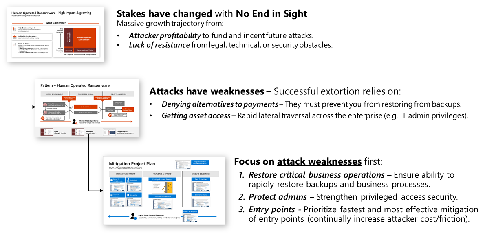

# Human-operated ransomware

Human-operated ransomware is a large and growing attack trend that represents a threat to organizations in every industry.

Human-operated ransomware is different than commodity ransomware. These “hands-on-keyboard” attacks target an organization rather than a single device and leverage human attackers’ knowledge of common system and security misconfigurations to infiltrate the organization, navigate the enterprise network, and adapt to the environment and its weaknesses as they go. 

Hallmarks of these human-operated ransomware attacks typically include credential theft and lateral movement and can result in deployment of a ransomware payload to high business impact resources the attackers choose.

These attacks can be catastrophic to business operations and are difficult to clean up, requiring complete adversary eviction to protect against future attacks. Unlike commodity ransomware that only requires malware remediation, human-operated ransomware will continue to threaten your business operations after the initial encounter. 

This figure shows how this extortion-based attack that uses maintenance and security configuration gaps and privileged access is growing in impact and likelihood.

## Protect your organization against ransomware and extortion

For a comprehensive view of ransomware and extortion and how to protect your organization, use the information in the **[Human-Operated Ransomware Mitigation Project Plan](https://download.microsoft.com/download/7/5/1/751682ca-5aae-405b-afa0-e4832138e436/RansomwareRecommendations.pptx)** PowerPoint presentation.

Here's a summary of the guidance:

- The stakes of ransomware and extortion are high.
- However, the attacks have weaknesses that can mitigate your likelihood of being attacked.
- There are three phases to configure your infrastructure to exploit attack weaknesses.

For the three phases to exploit attack weaknesses, see the [Protect your organization against ransomware and extortion](protect-against-ransomware.md) solution to **quickly** configure your IT infrastructure for the best protection:

1. Prepare your organization so you can recover from an attack without having to pay the ransom.
2. Limit the scope of damage of an attack by protecting privileged roles.
3. Make it harder for a ransomware attacker to get into your environment by incrementally removing risks.

You can also see an overview of the phases as levels of protection against ransomware attackers with the [Protect your organization from ransomware
poster](https://download.microsoft.com/download/5/e/3/5e37cbff-9a7a-45b2-8b95-6d3cc5426301/protect-your-organization-from-ransomware.pdf).

## Additional ransomware resources

Key information from Microsoft:

- [The growing threat of ransomware](https://blogs.microsoft.com/on-the-issues/2021/07/20/the-growing-threat-of-ransomware/), Microsoft On the Issues blog post on July 20, 2021
- [Rapidly protect against ransomware and extortion](protect-against-ransomware.md)
- [2021 Microsoft Digital Defense Report](https://www.microsoft.com/security/business/microsoft-digital-defense-report) (see pages 10-19)
- **Ransomware: A pervasive and ongoing threat** report in the **Threat analytics** node of the Microsoft 365 Defender portal (see these [licensing requirements](/microsoft-365/security/defender/prerequisites#licensing-requirements))

Microsoft 365:

- [Deploy ransomware protection for your Microsoft 365 tenant](/microsoft-365/solutions/ransomware-protection-microsoft-365)
- [Maximize Ransomware Resiliency with Azure and Microsoft 365](https://azure.microsoft.com/resources/maximize-ransomware-resiliency-with-azure-and-microsoft-365/)
- [Recover from a ransomware attack](/microsoft-365/security/office-365-security/recover-from-ransomware)
- [Malware and ransomware protection](/compliance/assurance/assurance-malware-and-ransomware-protection)
- [Protect your Windows 10 PC from ransomware](https://support.microsoft.com//windows/protect-your-pc-from-ransomware-08ed68a7-939f-726c-7e84-a72ba92c01c3)
- [Handling ransomware in SharePoint Online](/sharepoint/troubleshoot/security/handling-ransomware-in-sharepoint-online)

Microsoft 365 Defender:

- [Find ransomware with advanced hunting](/microsoft-365/security/defender/advanced-hunting-find-ransomware)

Microsoft Cloud App Security:

-  [Create anomaly detection policies in Cloud App Security](/cloud-app-security/anomaly-detection-policy)

Microsoft Azure:

- [Azure Defenses for Ransomware Attack](https://azure.microsoft.com/resources/azure-defenses-for-ransomware-attack/)
- [Maximize Ransomware Resiliency with Azure and Microsoft 365](https://azure.microsoft.com/resources/maximize-ransomware-resiliency-with-azure-and-microsoft-365/)
- [Backup and restore plan to protect against ransomware](backup-plan-to-protect-against-ransomware.md)
- [Help protect from ransomware with Microsoft Azure Backup](https://www.youtube.com/watch?v=VhLOr2_1MCg) (26 minute video)
- [Recovering from systemic identity compromise](/azure/security/fundamentals/recover-from-identity-compromise)
- [Advanced multistage attack detection in Azure Sentinel](/azure/sentinel/fusion#ransomware)
- [Fusion Detection for Ransomware in Azure Sentinel](https://techcommunity.microsoft.com/t5/azure-sentinel/what-s-new-fusion-detection-for-ransomware/ba-p/2621373)

Microsoft Security team blog posts:

- [3 steps to prevent and recover from ransomware (September 2021)](https://www.microsoft.com/security/blog/2021/09/07/3-steps-to-prevent-and-recover-from-ransomware/)
- [Becoming resilient by understanding cybersecurity risks: Part 4—navigating current threats (May 2021)](https://www.microsoft.com/security/blog/2021/05/26/becoming-resilient-by-understanding-cybersecurity-risks-part-4-navigating-current-threats/)

  See the **Ransomware** section.

- [Human-operated ransomware attacks: A preventable disaster (March 2020)](https://www.microsoft.com/security/blog/2020/03/05/human-operated-ransomware-attacks-a-preventable-disaster/)

  Includes attack chain analyses of actual attacks.

- [Ransomware response—to pay or not to pay? (December 2019)](https://www.microsoft.com/security/blog/2019/12/16/ransomware-response-to-pay-or-not-to-pay/)
- [Norsk Hydro responds to ransomware attack with transparency (December 2019)](https://www.microsoft.com/security/blog/2019/12/17/norsk-hydro-ransomware-attack-transparency/)

