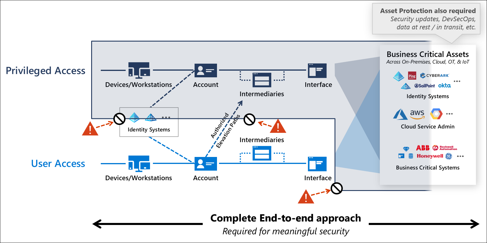
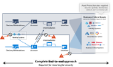
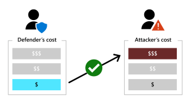
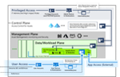

# Securing privileged access

Organization's should make securing privileged access the top security priority because of the significant potential business impact (and high likelihood) of attackers compromising this level of access.

Privileged access includes IT administrators with control of large portions of the enterprise estate and other users with access to business critical assets. 

Attackers frequently exploit weaknesses in privileged access security during [human operated ransomware attacks](https://www.microsoft.com/security/blog/2020/03/05/human-operated-ransomware-attacks-a-preventable-disaster/) and targeted data theft. Privileged access accounts and workstations are so attractive to attackers because these targets allow them to rapidly gain broad access to the business assets in the enterprise, often resulting in rapid and significant business impact.

The following diagram summarizes the recommended privileged access strategy to create an isolated virtual zone that these sensitive accounts can operate in with low risk. 

Securing privileged access effectively seals off unauthorized pathways completely and leaves a select few authorized access pathways that are protected and closely monitored. This diagram is discussed in more detail in the article, [Privileged Access Strategy](privileged-access-strategy.md).

Building this strategy requires a holistic approach combining multiple technologies to protect and monitor those authorized escalation paths using Zero Trust principles including explicit validation, least privilege, and assume breach. This strategy requires multiple complementary initiatives that establish a holistic technology approach, clear processes, and rigorous operational execution to build and sustain assurances over time. 

## Get started and measure progress

|   |   |   |   |
| --- | --- | --- | --- |
|  | [Rapid Modernization Plan (RaMP)](security-rapid-modernization-plan.md)   - Plan and implement the most impactful quick wins |  | [Best practices](https://docs.microsoft.com/azure/architecture/framework/security/critical-impact-accounts)   [Videos and Slides](https://docs.microsoft.com/security/compass/administration-videos-and-decks) |

## Industry references

Securing privileged access is also addresses by these industry standards and best practices.

|   |   |   |   |
| --- | --- | --- | --- |
| [US NIST / Department of Defense](https://nvd.nist.gov/ncp/checklist/833) | [UK National Cyber Security Center (NCSC)](https://www.ncsc.gov.uk/collection/secure-system-administration) | [Australian Cyber Security Center (ACSC)](https://www.cyber.gov.au/acsc/view-all-content/publications/secure-administration) | [MITRE ATT&CK](https://attack.mitre.org/mitigations/M1026/) |

## Next steps

Strategy, design, and implementation resources to help you rapidly secure privileged access for your environment.

| | Article | Description |
| :---: | --- | --- |
|  | [Strategy](privileged-access-strategy.md) | Overview of privileged access strategy |
|  | [Success criteria](privileged-access-success-criteria.md) | Strategic success criteria |
|  | [Security levels](privileged-access-security-levels.md) | Overview of security levels for accounts, devices, intermediaries, and interfaces |
|  | [Accounts](privileged-access-accounts.md) | Guidance on security levels and controls for accounts |
|  | [Intermediaries](privileged-access-intermediaries.md) | Guidance on security levels and controls for intermediaries |
|  | [Interfaces](privileged-access-interfaces.md) | Guidance on security levels and controls for interfaces |
|  | [Devices](concept-azure-managed-workstation.md) | Guidance on security levels and controls for devices and workstations |
|  | [Enterprise access model](privileged-access-access-model.md) | Overview of Enterprise Access Model (successor to legacy tier model) |
|  | [ESAE Retirement](esae-retirement.md) | Information on retirement of legacy administrative forest |
