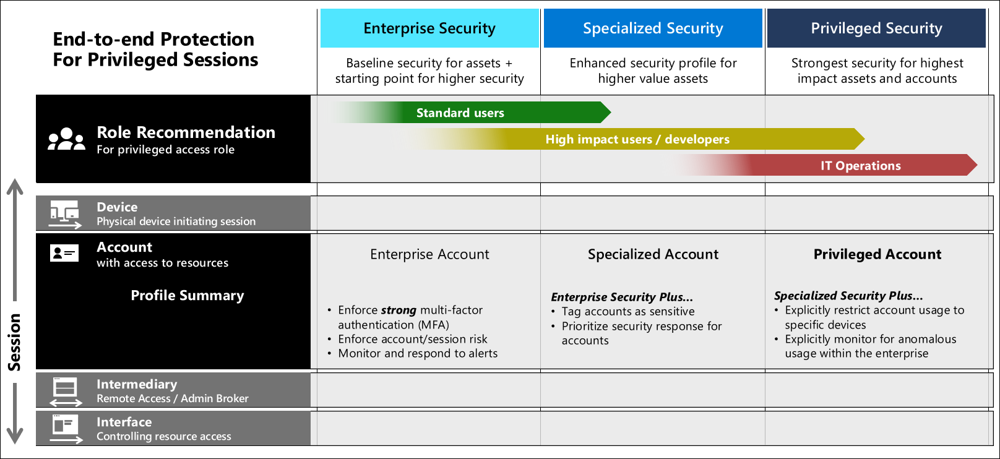
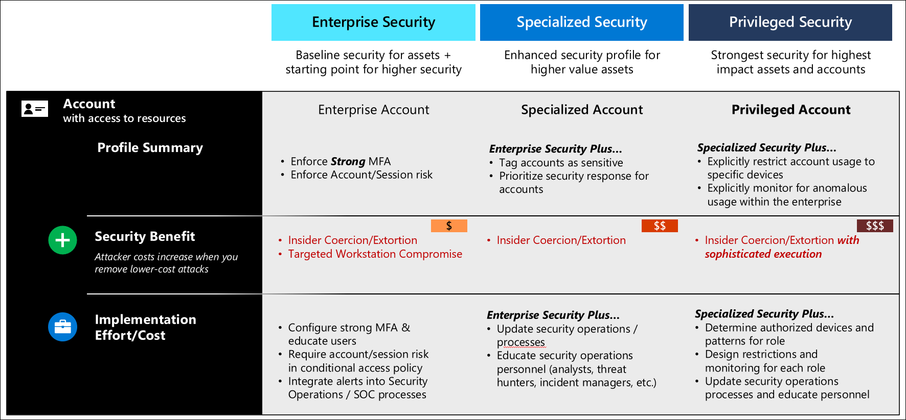
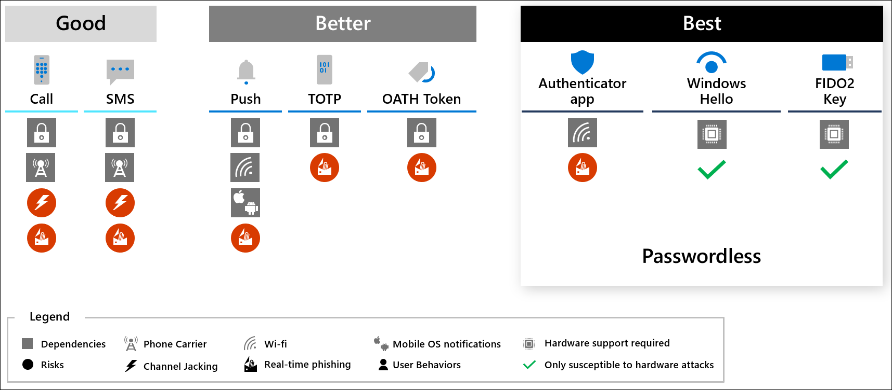

# Privileged access: Accounts

Account security is a critical component of [securing privileged access](overview.md). End to end Zero Trust security for sessions requires strongly establishing that the account being used in the session is actually under the control of the human owner and not an attacker impersonating them.

Strong account security starts with secure provisioning and full lifecycle management through to deprovisioning, and each session must establish strong assurances that the account isn't currently compromised based on all available data including historical behavior patterns, available threat intelligence, and usage in the current session.  

## Account security

This guidance defines three security levels for account security that you can use for assets with different sensitivity levels:

These levels establish clear and implementable security profiles appropriate for each sensitivity level that you can assign roles to and scale out rapidly. All of these account security levels are designed to maintain or improve productivity for people by limiting or eliminating interruption to user and admin workflows. 

## Planning account security 

This guidance outlines the technical controls required to meet each level. Implementation guidance is in the [privileged access roadmap](security-rapid-modernization-plan.md). 

### Account security controls

Achieving security for the interfaces requires a combination of technical controls that both protect the accounts and provide signals to be used in a Zero Trust policy decision (see Securing Interfaces for policy configuration reference).  

The controls used in these profiles include: 

- Multi-factor authentication - providing diverse sources of proof that the (designed to be as easy as possible for users, but difficult for an adversary to mimic). 
- Account risk - Threat and Anomaly Monitoring - using UEBA and Threat intelligence to identify risky scenarios
- Custom monitoring - For more sensitive accounts, explicitly defining allowed/accepted behaviors/patterns allows early detection of anomalous activity. This control is not suitable for general purpose accounts in enterprise as these accounts need flexibility for their roles.  

The combination of controls also enables you to improve both security and usability - for example a user who stays within their normal pattern (using the same device in same location day after day) does not need to be prompted for outside MFA every time they authenticate.  

### Enterprise security accounts 

The security controls for enterprise accounts are designed to create a secure baseline for all users and provide a secure foundation for specialized and privileged security:

- Enforce strong multi-factor authentication (MFA) - Ensure that the user is authenticated with strong MFA provided by an enterprise-managed identity system (detailed in the diagram below). For more information about multi-factor authentication, see [Azure security best practice 6](https://docs.microsoft.com/azure/cloud-adoption-framework/security/security-top-10#6-technology-require-passwordless-or-multi-factor-authentication-mfa).

   > [!NOTE]
   > While your organization may choose to use an existing weaker form of MFA during a transition period, attackers are increasingly evading the weaker MFA protections, so all new investment into MFA should be on the strongest forms. 

- Enforce account/session risk - ensure that the account is not able to authenticate unless it is at a low (or medium?) risk level. See Interface Security Levels for details on conditional enterprise account security. 
- Monitor and respond to alerts - Security operations should integrate account security alerts and get sufficient training on how these protocols and systems work to ensure they are able to rapidly comprehend what an alert means and react accordingly. 
   - Enable [Azure AD Identity Protection](https://docs.microsoft.com/azure/active-directory/identity-protection/overview-identity-protection)
   - [Investigate risk Azure AD Identity Protection](https://docs.microsoft.com/azure/active-directory/identity-protection/howto-identity-protection-investigate-risk)
   - [Troubleshoot/Investigate Conditional Access Sign-in failures](https://docs.microsoft.com/azure/active-directory/conditional-access/troubleshoot-conditional-access)

The following diagram provides a comparison to different forms of MFA and passwordless authentication. Each option in the best box is considered both high security and high usability. Each has different hardware requirements so you may want to mix and match which ones apply to different roles or individuals. All Microsoft passwordless solutions are recognized by Conditional Access as multi-factor authentication because they require combining something you have with either biometrics, something you know, or both.  

 > [!NOTE]
 > For more information on why SMS and other phone based authentication is limited, see the blog post [It's Time to Hang Up on Phone Transports for Authentication](https://techcommunity.microsoft.com/t5/azure-active-directory-identity/it-s-time-to-hang-up-on-phone-transports-for-authentication/ba-p/1751752).

### Specialized accounts

Specialized accounts are a higher protection level suitable for sensitive users. Because of their higher business impact, specialized accounts warrant additional monitoring and prioritization during security alerts, incident investigations, and threat hunting. 

Specialized security builds on the strong MFA in enterprise security by identifying the most sensitive accounts and ensuring alerts and response processes are prioritized:

1. Identify Sensitive Accounts - See specialized security level guidance for identifying these accounts. 
1. Tag Specialized Accounts - Ensure each sensitive account is tagged
   1. [Configure Azure Sentinel Watchlists](https://docs.microsoft.com/azure/sentinel/watchlists) to identify these sensitive accounts 
   1. [Configure Priority Account Protection in Microsoft Defender for Office 365](https://techcommunity.microsoft.com/t5/microsoft-defender-for-office/announcing-priority-account-protection-in-microsoft-defender-for/ba-p/1696385) and designate specialized and privileged accounts as priority accounts - 
1. Update Security Operations processes - to ensure these alerts are given the highest priority
1. Set up Governance - Update or create governance process to ensure that
   1. All new roles to are evaluated for specialized or privileged classifications as they are created or changed
   1. All new accounts are tagged as they are created
   1. Continuous or periodic out of band checks to ensure that roles and accounts didn't get missed by normal governance processes. 

### Privileged accounts

Privileged accounts have the highest level of protection because they represent a significant or material potential impact on the organization's operations if compromised.

Privileged accounts always include IT Admins with access to most or all enterprise systems, including most or all business critical systems. Other accounts with a high business impact may also warrant this additional level of protection. For more information about which roles and accounts should be protected at what level, see the article [Privileged Security](privileged-access-security-levels.md).

In addition to specialized security , privileged account security increases both:

- Prevention - add controls to restrict the usage of these accounts to the designated devices, workstations, and intermediaries. 
- Response - closely monitor these accounts for anomalous activity and rapidly investigate and remediate the risk. 

## Configuring privileged account security 

Follow the guidance in the [Security rapid modernization plan](security-rapid-modernization-plan.md) to both increase the security of your privileged accounts and decrease your cost to manage. 

## Next steps

- [Securing privileged access overview](overview.md)
- [Privileged access strategy](privileged-access-strategy.md)
- [Measuring success](privileged-access-success-criteria.md)
- [Security levels](privileged-access-security-levels.md)
- [Intermediaries](privileged-access-intermediaries.md)
- [Interfaces](privileged-access-interfaces.md)
- [Privileged access devices](privileged-access-devices.md)
- [Enterprise access model](privileged-access-access-model.md)
