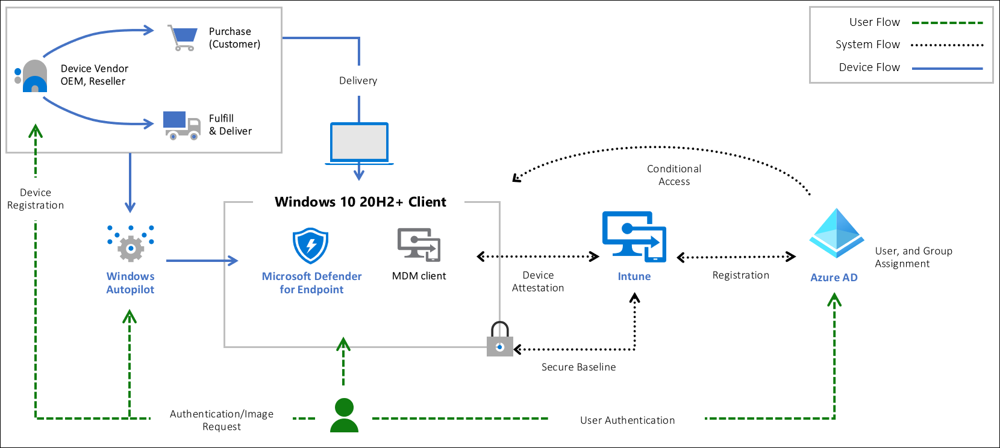
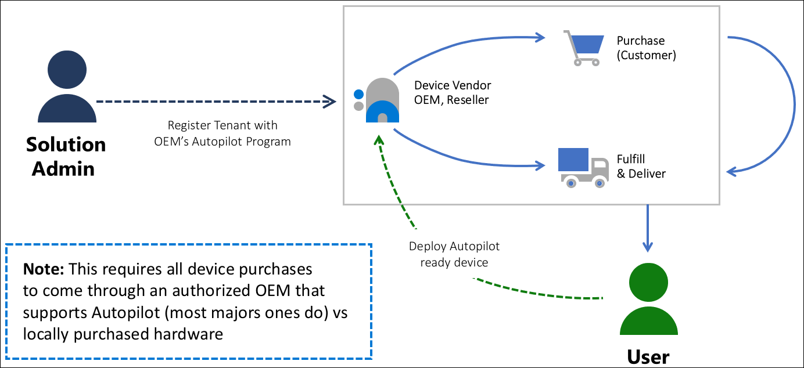
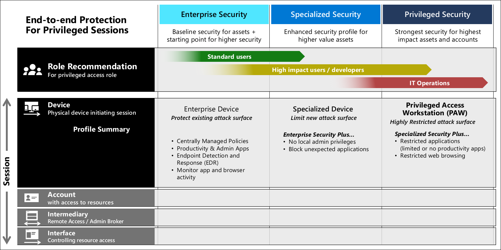

# Securing devices as part of the privileged access story

This guidance is part of a complete [privileged access strategy](privileged-access-strategy.md) and is implemented as part of the [Privileged access deployment](privileged-access-deployment.md)

End to end zero trust [security for privileged access](overview.md) requires a strong foundation of device security upon which to build other security assurances for the  session. While security assurances may be enhanced in the session, they will always be limited by how strong the security assurances are in the originating device. An attacker with control of this device can impersonate users on it or steal their credentials for future impersonation. This risk undermines other assurances on the account, intermediaries like jump servers, and on the resources themselves. For more information, see [clean source principle](privileged-access-success-criteria.md#clean-source-principle)

The article provides an overview of security controls to provide a secure workstation for sensitive users throughout its lifecycle. 

This solution relies on core security capabilities in the Windows 10 operating system, Microsoft Defender for Endpoint, Azure Active Directory, and Microsoft InTune.

## Who benefits from a secure workstation?

All users and operators benefit from using a secure workstation. An attacker who compromises a PC or device can impersonate or steal credentials/tokens for all accounts that use it, undermining many or all other security assurances. For administrators or sensitive accounts, this allows attackers to escalate privileges and increase the access they have in your organization, often dramatically to domain, global, or enterprise administrator privileges. 

For details on security levels and which users should be assigned to which level, see [Privileged access security levels](privileged-access-security-levels.md)

## Device Security Controls

The successful deployment of a secure workstation requires it to be part of an end to end approach including devices, [accounts](privileged-access-accounts.md), [intermediaries](privileged-access-intermediaries.md), and security policies applied to your [application interfaces](privileged-access-interfaces.md). All elements of the stack must be addressed for a complete privileged access security strategy.

This table summarizes the security controls for different device levels:

| Profile | Enterprise | Specialized | Privileged |
| :---: | :---: | :---: |:---: |
| Microsoft Endpoint Manager (MEM) managed | Yes | Yes | Yes | 
| Deny BYOD Device enrollment | No | Yes | Yes |
| MEM security baseline applied | Yes | Yes | Yes |
| Microsoft Defender for Endpoint | Yes* | Yes | Yes |
| Join personal device via Autopilot | Yes* | Yes* | No |
| URLs restricted to approved list | Allow Most | Allow Most | Deny Default |
| Removal of admin rights |  | Yes | Yes |
| Application execution control (AppLocker)|  | Audit -> Enforced | Yes |
| Applications installed only by MEM | | Yes | Yes |

> [!NOTE]
> The solution can be deployed with new hardware, existing hardware, and bring your own device (BYOD) scenarios. 

At all levels, good security maintenance hygiene for security updates will be enforced by Intune policies. The differences in security as the device security level increases are focused on reducing the attack surface that an attacker can attempt to exploit (while preserving as much user productivity as possible). Enterprise and specialized level devices  allow productivity applications and general web browsing, but privileged access workstations do not. Enterprise users may install their own applications, but specialized users may not (and are not local administrators of their workstations). 

> [!NOTE]
> Web browsing here refers to general access to arbitrary websites which can be a high risk activity. Such browsing is distinctly different from using a web browser to access a small number of well-known administrative websites for services like Azure, Microsoft 365, other cloud providers, and SaaS applications.

### Hardware root of trust

Essential to a secured workstation is a supply chain solution where you use a trusted workstation called the 'root of trust'. Technology that must be considered in the selection of the root of trust hardware should include the following technologies included in modern laptops: 

* [Trusted Platform Module (TPM) 2.0](/windows-hardware/design/device-experiences/oem-tpm)
* [BitLocker Drive Encryption](/windows-hardware/design/device-experiences/oem-bitlocker)
* [UEFI Secure Boot](/windows-hardware/design/device-experiences/oem-secure-boot)
* [Drivers and Firmware Distributed through Windows Update](/windows-hardware/drivers/dashboard/understanding-windows-update-automatic-and-optional-rules-for-driver-distribution)
* [Virtualization and HVCI Enabled](/windows-hardware/design/device-experiences/oem-vbs)
* [Drivers and Apps HVCI-Ready](/windows-hardware/test/hlk/testref/driver-compatibility-with-device-guard)
* [Windows Hello](/windows-hardware/design/device-experiences/windows-hello-biometric-requirements)
* [DMA I/O Protection](/windows/security/information-protection/kernel-dma-protection-for-thunderbolt)
* [System Guard](/windows/security/threat-protection/windows-defender-system-guard/system-guard-how-hardware-based-root-of-trust-helps-protect-windows)
* [Modern Standby](/windows-hardware/design/device-experiences/modern-standby)

For this solution, root of trust will be deployed using [Windows Autopilot](/mem/autopilot/windows-autopilot) technology with hardware that meets the modern technical requirements. To secure a workstation, Autopilot lets you leverage Microsoft OEM-optimized Windows 10 devices. These devices come in a known good state from the manufacturer. Instead of reimaging a potentially insecure device, Autopilot can transform a Windows 10 device into a “business-ready” state. It applies settings and policies, installs apps, and even changes the edition of Windows 10. 

## Device roles and profiles

This guidance shows how to harden Windows 10 and reduce the risks associated with device or user compromise. To take advantage of the modern hardware technology and root of trust device, the solution uses [Device Health Attestation](https://techcommunity.microsoft.com/t5/Intune-Customer-Success/Support-Tip-Using-Device-Health-Attestation-Settings-as-Part-of/ba-p/282643). This capability is present to ensure the attackers cannot be persistent during the early boot of a device. It does so by using policy and technology to help manage security features and risks.

* **Enterprise Device** –  The first managed role is good for home users, small business users, general developers, and enterprises where organizations want to raise the minimum security bar. This profile permits users to run any applications and browse any website, but an anti-malware and endpoint detection and response (EDR) solution like [Microsoft Defender for Endpoint](/windows/security/threat-protection/) is required. A policy-based approach to increase the security posture is taken. It provides a secure means to work with customer data while also using productivity tools like email and web browsing. Audit policies and Intune allow you to monitor an Enterprise workstation for user behavior and profile usage. 

The enterprise security profile in the [privileged access deployment](privileged-access-deployment.md) guidance uses JSON files to configure this with Windows 10 and the provided JSON files. 

* **Specialized Device** – This represents a significant step up from enterprise usage by removing the ability to self-administer the workstation and limiting which applications may run to only the applications installed by an authorized administrator (in the program files and pre-approved applications in the user profile location. Removing the ability to install applications may impact productivity if implemented incorrectly, so ensure that you have provided access to Microsoft store applications or corporate managed applications that can be rapidly installed to meet users needs. For guidance on which users should be configured with specialized level devices, see [Privileged access security levels](privileged-access-security-levels.md)
   * The Specialized security user demands a more controlled environment while still being able to do activities such as email and web browsing in a simple-to-use experience. These users expect features such as cookies, favorites, and other shortcuts to work but do not require the ability to modify or debug their device operating system, install drivers, or similar.

The specialized security profile in the [privileged access deployment](privileged-access-deployment.md) guidance uses JSON files to configure this with Windows 10 and the provided JSON files. 

* **Privileged Access Workstation (PAW)** – This is the highest security configuration designed for extremely sensitive roles that would have a significant or material impact on the organization if their account was compromised. The PAW configuration includes security controls and policies that restrict local administrative access and productivity tools to minimize the attack surface to only what is absolutely required for performing sensitive job tasks. 
This makes the PAW device difficult for attackers to compromise because it blocks the most common vector for phishing attacks: email and web browsing. 
To provide productivity to these users, separate accounts and workstations must be provided for productivity applications and web browsing. While inconvenient, this is a necessary control to protect users whose account could inflict damage to most or all resources in the organization. 
   * A Privileged workstation provides a hardened workstation that has clear application control and application guard. The workstation uses credential guard, device guard, app guard, and exploit guard to protect the host from malicious behavior. All local disks are encrypted with BitLocker and web traffic is restricted to a limit set of permitted destinations (Deny all).

The privileged security profile in the [privileged access deployment](privileged-access-deployment.md) guidance uses JSON files to configure this with Windows 10 and the provided JSON files. 

## Next steps

[Deploy a secure Azure-managed workstation](privileged-access-deployment.md).
