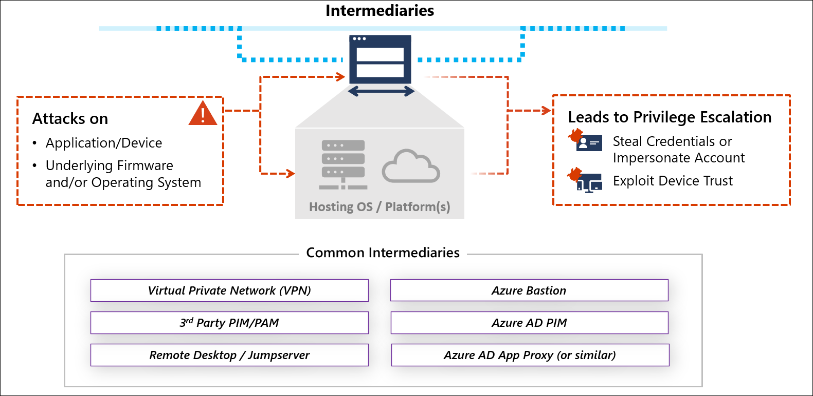
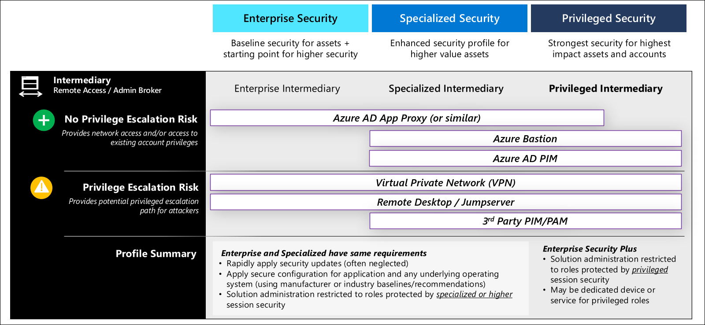
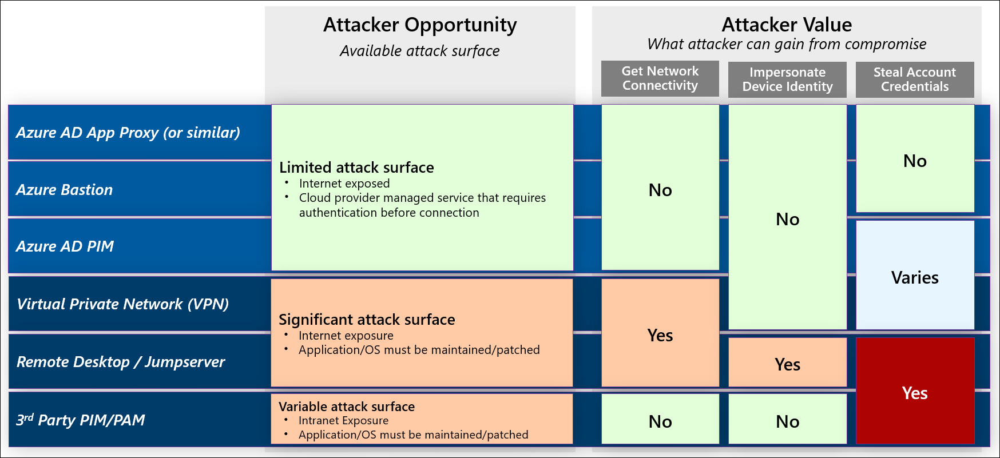
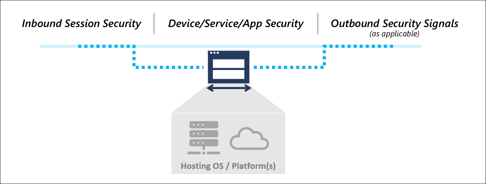

# Privileged access: Intermediaries

Security of intermediary devices is a critical component of [securing privileged access](overview.md). 

Intermediaries add link to the chain of Zero Trust assurance for the user or administrator's end to end session, so they must sustain (or improve) the Zero Trust security assurances in the session. Examples of intermediaries include virtual private networks (VPNs), jump servers, virtual desktop infrastructure (VDI), as well as application publishing through access proxies. 

An attacker can attack an intermediary to attempt to escalating privileges using credentials stored on them, get network remote access to corporate networks, or exploit trust in that device if being used for Zero Trust access decisions. Targeting intermediaries has become an all too common, especially for organizations that don't rigorously maintain the security posture of these devices. For example, [credentials collected from VPN devices](https://www.bleepingcomputer.com/news/security/passwords-exposed-for-almost-50-000-vulnerable-fortinet-vpns/). 

Intermediaries vary in purpose and technology, but typically provide remote access, session security, or both:

- **Remote access** - Enable access to systems on enterprise networks from the internet 
- **Session security** - Increase security protections and visibility for a session
   - **Unmanaged device scenario** - Providing a managed virtual desktop to be accessed by unmanaged devices (for example, personal employee devices) and/or devices managed by a partner/vendor. 
   - **Administrator security scenario** - Consolidate administrative pathways and/or increase security with just in time access, session monitoring and recording, and similar capabilities.  

Ensuring security assurances are sustained from the originating device and account through to the resource interface requires understanding the risk profile of the intermediary and mitigation options. 

## Attacker opportunity and value

Different intermediary types perform unique functions so they each require a different security approach, though there are some critical commonalities like rapidly applying security patches to appliances, firmware, operating systems, and applications. 

The **attacker opportunity** is represented by the available attack surface an attack operator can target:

- **Native cloud services** like Azure AD PIM, Azure Bastion, and Azure AD App Proxy offer a limited attack surface to attackers. While they are exposed to the public internet, customers (and attackers) have no access to underlying operating systems providing the services and they are typically maintained and monitored consistently via automated mechanisms at the cloud provider. This smaller attack surface limits the available options to attackers vs. classic on-premises applications and appliances that must be configured, patched, and monitored by IT personnel who are often overwhelmed by conflicting priorities and more security tasks than they have time to complete. 
- **Virtual Private Networks (VPNs)** and **Remote Desktops** / **Jump servers** frequently have a significant attacker opportunity as they are exposed to the internet to provide remote access and the maintenance of these systems is frequently neglected. 
While they only have a few network ports exposed, attackers only need access to one unpatched service for an attack. 
- **Third-party PIM/PAM** services are frequently hosted on-premises or as a VM on Infrastructure as a Service (IaaS) and are typically only available to intranet hosts. While not directly internet exposed, a single compromised credential may allow attackers to access the service over VPN or another remote access medium. 

**Attacker value** represents what an attacker can gain by compromising an intermediary. A compromise is defined as an attacker gaining full control over the application/VM and/or an administrator of the customer instance of the cloud service. 

The ingredients that attackers can collect from an intermediary for the next stage of their attack include:

- **Get network connectivity** to communicate with most or all resource on enterprise networks.
   This access is typically provided by VPNs and Remote Desktop / Jump server solutions. While Azure Bastion and Azure AD App Proxy (or similar third-party solutions) solutions also provide remote access, these solutions are typically application or server-specific connections and don’t provide general network access
- **Impersonate device identity** - can defeat Zero Trust mechanisms if a device is required for authentication and/or be used by an attacker to gather intelligence on the targets networks. Security Operations teams often don't closely monitor device account activity and focus only on user accounts. 
- **Steal account credentials** to authenticate to resources, which are the most valuable asset to attackers as it offers the ability to elevate privileges to access their ultimate goal or the next stage in the attack.
Remote Desktop / Jump servers and third-party PIM/PAM are the most attractive targets and have the “All your eggs in one basket” dynamic with increased attacker value and security mitigations:
   - **PIM/PAM** solutions typically store the credentials for most or all privileged roles in the organization, making them a highly lucrative target to compromise or to weaponize. 
   - **Azure AD PIM** doesn't offer attackers the ability to steal credentials because it unlocks privileges already assigned to an account using MFA or other workflows, but a poorly designed workflow could allow an adversary to escalate privileges.
   - **Remote Desktop / Jump servers** used by administrators provide a host where many or all sensitive sessions pass through, enabling attackers to use standard credential theft attack tools to steal and reuse these credentials.  
   - **VPNs** can store credentials in the solution, providing attackers with a potential treasure trove of privilege escalation, leading to the strong recommendation to use Azure AD for authentication to mitigate this risk.

## Intermediary security profiles

Establishing these assurances requires a combination of security controls, some of which are common to many intermediaries, and some of which specific to the type of intermediary. 

An intermediary is a link in the Zero Trust chain that presents an interface to users/devices and then enables access to the next interface. The security controls must address inbound connections, security of the intermediary device/application/service itself, and (if applicable) provide Zero Trust security signals for the next interface. 

## Common security controls

The common security elements for intermediaries are focused on maintaining good security hygiene for enterprise and specialized levels, with additional restrictions for privilege security. 

These security controls should be applied to all types of intermediaries:

- **Enforce inbound connection security** - Use Azure AD and Conditional Access to ensure  all inbound connections from devices and accounts are known, trusted, and allowed. For more information, see the article [Secuiting privileged interfaces](privileged-access-interfaces.md) for detailed definitions for device and account requirements for enterprise and specialized.
- **Proper system maintenance** - All intermediaries must follow good security hygiene practices including:
   - **Secure configuration** - Follow manufacturer or industry security configuration baselines and best practices for both the application and any underlying operating systems, cloud services, or other dependencies. Applicable guidance from Microsoft includes the Azure Security Baseline and Windows Baselines.
   - **Rapid patching** - Security updates and patches from the vendors must be applied rapidly after release. 
- **Role-Based Access Control (RBAC)** models can be abused by attackers to escalate privileges. The RBAC model of the intermediary must be carefully review to ensure that only authorized personnel that are protected at a specialized or privileged level are granted administrative privileges. This model must include any underlying operating systems or cloud services (root account password, local administrator users/groups, tenant administrators, etc.).
- **Endpoint detection and response (EDR) and outbound trust signal** - Devices that include a full operating system should be monitored and protected with an EDR like Microsoft Defender for Endpoints. This control should be configured to provides device compliance signals to Conditional Access so that policy can enforce this requirement for interfaces. 

Privileged Intermediaries require additional security controls:

- **Role-Based Access Control (RBAC)** - Administrative rights must be restricted to only privileged roles meeting that standard for workstations and accounts.  
- **Dedicated devices (optional)** - because of the extreme sensitivity of privileged sessions, organizations may choose to implement dedicated instances of intermediary functions for privileged roles. This control enables additional security restrictions for these privileged intermediaries and closer monitoring of privileged role activity. 

## Security guidance for each intermediary type

This section contains specific security guidance unique to each type of intermediary.

### Privileged Access Management / Privileged Identity management 

One type of intermediary designed explicitly for security use cases is privileged identity management / privileged access management (PIM/PAM) solutions. 

#### Use cases and scenarios for PIM/PAM 

PIM/PAM solutions are designed to increase security assurances for sensitive accounts that would be covered by specialized or privileged profiles, and typically focus first on IT administrators. 

While features vary between PIM/PAM vendors, many solutions provide security capabilities to:

- Simplify service account management and password rotation (a critically important capability)
- Provide advanced workflows for just in time (JIT) access
- Record and monitor administrative sessions

   > [!IMPORTANT]
   > PIM/PAM capabilities provide excellent mitigations for some attacks, but do not address many privielged access risks, notably risk of device compromise. While some vendors advocate that their PIM/PAM solution is a 'silver bullet' solution that can mitigate device risk, our experience investigating customer incidents has consistently proven that this does not work in practice.
   >
   > An attacker with control of a workstation or device can use those credentials (and privileges assigned to them) while the user is logged on (and can often steal credentials for later use as well). A PIM/PAM solution alone cannot consistently and reliably see and mitigate these device risks, so you must have discrete device and account protections that complement each other. 

#### Security risks and recommendations for PIM/PAM

The capabilities from each PIM/PAM vendor vary on how to secure them, so review and follow your vendor's specific security configuration recommendations and best practices.

 > [!NOTE]
 > Ensure you set up a second person in business critical workflows to help mitigate insider risk (increases the cost/friction for potential collusion by insider threats).

### End-user Virtual Private Networks

Virtual Private Networks (VPNs) are intermediaries that provide full network access for remote endpoints, typically require the end user to authenticate, and can store credentials locally to authenticate inbound user sessions. 

 > [!NOTE]
 > This guidance refers only to "point to site" VPNs used by users, not "site to site" VPNs that are typically used for datacenter/application connectivity. 

#### Use cases and scenarios for VPNs

VPNs establish remote connectivity to enterprise network to enable resource access for users and administrators.

#### Security risks and recommendations for VPNs

The most critical risks to VPN intermediaries are from maintenance neglect, configuration issues, and local storage of credentials. 

Microsoft recommends a combination of controls for VPN intermediaries:

- **Integrate Azure AD authentication** - to reduce or eliminate risk of locally stored credentials (and any overhead burden to maintain them) and enforce Zero Trust policies on inbound accounts/devices with conditional access. 
For guidance on integrating, see
   - [Azure VPN AAD integration](https://docs.microsoft.com/azure/vpn-gateway/vpn-gateway-radius-mfa-nsp)
   - [Enable Azure AD Authentication on the VPN gateway](https://docs.microsoft.com/azure/vpn-gateway/openvpn-azure-ad-tenant#enable-authentication)
   - Integrating third-party VPNs 
      - [Cisco AnyConnect](https://docs.microsoft.com/azure/active-directory/saas-apps/cisco-anyconnect)
      - Palo Alto Networks [GlobalProtect](https://docs.microsoft.com/azure/active-directory/saas-apps/palo-alto-networks-globalprotect-tutorial) and [Captive Portal](https://docs.microsoft.com/azure/active-directory/saas-apps/paloaltonetworks-captiveportal-tutorial)
      - [F5](https://docs.microsoft.com/azure/active-directory/saas-apps/headerf5-tutorial)
      - [Fortinet FortiGate SSL VPN](https://docs.microsoft.com/azure/active-directory/saas-apps/fortigate-ssl-vpn-tutorial)
      - [Citrix NetScaler](https://docs.microsoft.com/azure/active-directory/saas-apps/citrix-netscaler-tutorial)
      - [Zscaler Private Access (ZPA)](https://docs.microsoft.com/azure/active-directory/saas-apps/zscalerprivateaccess-tutorial)
      - and [more](https://docs.microsoft.com/azure/active-directory/saas-apps/tutorial-list)
- **Rapid patching** - Ensure that all organizational elements support rapid patching including: 
   - **Organizational sponsorship** and leadership support for requirement
   - **Standard technical processes** for updating VPNs with minimal or zero downtime. This process should include VPN software, appliances, and any underlying operating systems or firmware
   - **Emergency processes** to rapidly deploy critical security updates
   - **Governance** to continually discover and remediate any missed items
- **Secure configuration** - The capabilities from each VPN vendor vary on how to secure them, so review and follow your vendor's specific security configuration recommendations and best practices
- **Go beyond VPN** - Replace VPNs over time with more secure options like Azure AD App Proxy or Azure Bastion as these provide only direct application/server access rather than full network access. Additionally Azure AD App Proxy allows session monitoring for additional security with Microsoft Cloud App Security.

### Azure AD App Proxy

Azure AD App Proxy and similar third-party capabilities provide remote access to legacy and other applications hosted on-premises or on IaaS VMs in the cloud. 

#### Use cases and scenarios for Azure AD App Proxy

This solution is suitable for publishing legacy end-user productivity applications to authorized users over the internet. It can also be used for publishing some administrative applications. 

#### Security risks and recommendations for Azure AD App Proxy

Azure AD App proxy effectively retrofits modern Zero Trust policy enforcement to existing applications. For more information, see Security considerations for Azure AD Application Proxy 

Azure AD Application Proxy can also integrate with Microsoft Cloud App Security to add Conditional Access App Control session security to:

- Prevent data exfiltration
- Protect on download
- Prevent upload of unlabeled files
- Monitor user sessions for compliance
- Block access
- Block custom activities

For more information, see [Deploy Cloud App Security Conditional Access App Control for Azure AD apps](https://docs.microsoft.com/cloud-app-security/proxy-deployment-aad)

As you publish applications via the Azure AD Application Proxy, Microsoft recommends having application owners work with security teams to follow least privilege and ensure access to each application is made available to only the users that require it. As you deploy more apps this way, you may be able to offset some end-user point to site VPN usage.

### Remote Desktop / jump server

This scenario provides a full desktop environment running one or more applications. This solution has a number of different variations including:

- **Experiences** - Full desktop in a window or a single application projected experience
- **Remote host** - may be a shared VM or a dedicated desktop VM using Windows Virtual Desktop (WVD) or another Virtual Desktop Infrastructure (VDI) solution.  
- **Local device** - may be a mobile device, a managed workstation, or a personal/partner managed workstation
- **Scenario** - focused on user productivity applications or on administrative scenarios, often called a 'jump server'

#### Use cases and security recommendations for Remote Desktop / Jump server

The most common configurations are:

- Direct Remote Desktop Protocol (RDP) - This configuration is not recommended for internet connections because RDP is a protocol that has limited protections against modern attacks like password spray. Direct RDP should be converted to either:
   - RDP through a gateway published by Azure AD App Proxy
   - Azure Bastion
- RDP through a gateway using 
   - Remote Desktop Services (RDS) included in Windows Server. Publish with Azure AD Application Proxy.
   - Windows Virtual Desktop (WVD) - Follow Windows Virtual Desktop security best practices.
   - Third-party VDI - Follow manufacturer or industry best practices, or adapt WVD guidance to your solution
- Secure Shell (SSH) server - providing remote shell and scripting for technology departments and workload owners. Securing this configuration should include:
   - Following industry/manufacturer best practices to securely configure it, change any default passwords (if applicable), and using SSH keys instead of passwords, and securely storing and managing SSH keys. 
   - Use Azure Bastion for SSH remoting to resources hosted in Azure - Connect to a Linux VM using Azure Bastion 

### Azure Bastion

Azure Bastion is an intermediary that is designed to provide secure access to Azure resources using a browser and the Azure portal. Azure Bastion provides access resources in Azure that support Remote Desktop Protocol (RDP) and Secure Shell (SSH) protocols. 

#### Use cases and scenarios for Azure Bastion

[Azure Bastion](https://docs.microsoft.com/azure/bastion/bastion-overview) effectively provides a flexible solution that can be used by IT Operations personnel and workload administrators outside of IT to manage resources hosted in Azure without requiring a full VPN connection to the environment. 

#### Security risks and recommendations for Azure Bastion

Azure Bastion is accessed through the Azure portal, so ensure that your Azure portal [interface](privileged-access-interfaces.md) requires the appropriate [level of security](privileged-access-security-levels.md) for the resources in it and roles using it, typically privileged or specialized level.

Additional guidance is available in the Azure Bastion Documentation

## Next steps

- [Securing privileged access overview](overview.md)
- [Privileged access strategy](privileged-access-strategy.md)
- [Measuring success](privileged-access-success-criteria.md)
- [Security levels](privileged-access-security-levels.md)
- [Privileged access accounts](privileged-access-accounts.md)
- [Interfaces](privileged-access-interfaces.md)
- [Privileged access devices](concept-azure-managed-workstation.md)
- [Enterprise access model](privileged-access-access-model.md)
