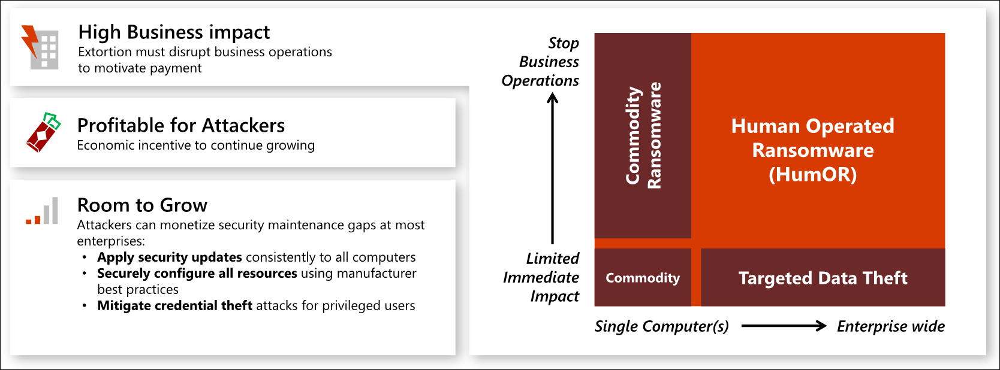
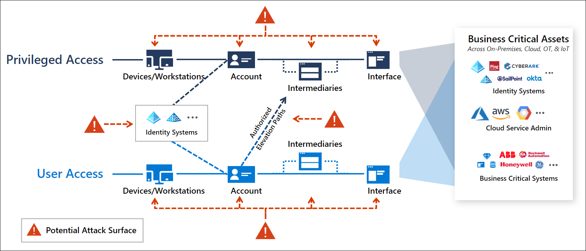

# Privileged access: Strategy

Microsoft recommends adopting this privileged access strategy to rapidly lower the risks to your organization from high impact and high likelihood attacks on privileged access. 

_**Privileged access should be the top security priority at every organization.**_ Any compromise of these users has a high likelihood of significant negative impact to the organization. Privileged users have access to business critical assets in an organization, nearly always causing major impact when attackers compromise their accounts. 

This strategy is built on Zero Trust principles of explicit validation, least privilege, and assumption of breach. Microsoft has provided [implementation guidance](security-rapid-modernization-plan.md) to help you rapidly deploy protections based on this strategy

> [!IMPORTANT]
> There is no single "silver bullet" technical solution that will magically mitigate privileged access risk, you must blend multiple technologies together into a holistic solution that protects against multiple attacker entry points. Organizations must bring the right tools for each part of the job. 

## Why is privileged access important? 

Security of privileged access is critically important because it is foundational to all other security assurances, an attacker in control of your privileged accounts can undermine all other security assurances. From a risk perspective, loss of privileged access is a high impact event with a high likelihood of happening that is growing at an alarming rate across industries. 

These attack techniques were initially used in targeted data theft attacks that resulted in many high profile breaches at familliar brands (and many unreported incidents). More recently these techniques have been adopted by ransomware attackers, fueling an explosive growth of highly profitable human operated ransomware attacks that intentionally disrupt business operations across industry.

> [!IMPORTANT] 
> Human operated ransomware is different from commodity single computer ransowmare attacks that target a single workstation or device

This graphic describes how this extortion based attack is growing in impact and likelihood using privileged access:

- High business impact 
   - It is difficult to overstate the potential business impact and damage of a loss to privileged access. Attacker's with privileged access effectively have full control of all enterprise assets and resources, giving them the ability to disclose any confidential data, stop all business processes, or subvert business processes and machines to damage property, hurt people, or worse. 
	Massive business impact has been seen across every industry with: 
      - **Targeted data theft** - attackers use privileged access to access and steal sensitive intellectual property for their own use it or to sell/transfer to your competitors or foreign governments
      - **Human-operated ransomware (HumOR)** - attackers use privileged access to steal and/or encrypt all data and systems in the enterprise, often stopping all business operations. They then extort the target organization by demanding money to not disclose the data and/or providing the keys to unlock it. 
- High likelihood of occurrence  
   - The prevalence of privileged access attacks has grown since the advent of modern credential theft attacks starting with [pass the hash techniques](https://en.wikipedia.org/wiki/Pass_the_hash). These techniques first jumped in popularity with criminals starting with the 2008 release of the attack tool "Pass-the-Hash Toolkit" and have grown into a suite of reliable attack techniques (mostly based on the [Mimikatz](https://github.com/gentilkiwi/mimikatz) toolkit). This weaponization and automation of  techniques allowed the attacks (and their subsequent impact) to grow at a rapid rate, limited only by the target organization's vulnerability to the attacks and the attacker's monetization/incentive models.  
      - Prior to the advent of human-operated ransomware (HumOR), these attacks were prevalent but often unseen or misunderstood because of: 
         - **Attacker monetization limits** - Only groups and individuals who knew how to monetize sensitive intellectual property from target organizations could profit from these attacks. 
         - **Silent impact** - Organizations often missed these attacks because they didn't have detection tools, and also had a hard time seeing and estimating the resulting business impact (for example, how  their competitors were using their stolen intellectual property and how that affected prices and markets, sometimes years later). Additionally, organizations who saw the attacks often stayed silent about them to protect their reputations. 
      - Both the silent impact and attacker monetization limitations on these attacks are disintegrating with the advent of human operated ransomware, which is growing in volume, impact, and awareness because it is both: 
         - **Loud and disruptive** - to business processes to payment of extortion demands.
         - **Universally applicable** - Every organization in every industry is financially motivated to continue operations uninterrupted.
	
For these reasons, privileged access should be the top security priority at every organization. 

## Building your privileged access strategy

Privileged access strategy is a journey that must be composed of quick wins and incremental progress. Each step in your privileged access strategy must take you closer to "seal" out persistent and flexible attackers from privileged access, who are like water trying to seep into your environment through any available weakness. 

This guidance is designed for all enterprise organizations regardless of where you already are in the journey. 

### Holistic practical strategy

Reducing risk from privileged access requires a thoughtful, holistic, and prioritized combination of risk mitigations spanning multiple technologies. 

Building this strategy requires recognition that attackers are like water as they have numerous options they can exploit (some of which can appear insignificant at first), attackers are flexible in which ones they use, and they generally take the path of least resistance to achieving their objectives. 

The paths attackers prioritize in actual practice are a combination of:

- Established techniques (often automated into attack tools) 
- New techniques that are easier to exploit 

Because of the diversity of technology involved, this strategy requires a complete strategy that combines multiple technologies and follows [Zero Trust principles](https://docs.microsoft.com/security/zero-trust/). 

 > [!IMPORTANT]
 > You must adopt a strategy that includes multiple technologies to defend against these attacks. Simply implementing a prvileged identity management / privileged access management (PIM/PAM) solution is not sufficient. For more information see, [Privileged access Intermediaries](/privileged-access-intermediaries.md#security-guidance-for-each-intermediary-type). 

- The attackers  are goal-oriented and technology agnostic, using any type of attack that works 
- The access control backbone you are defending is integrated into most or all systems in the enterprise environment. 

Expecting you can detect or prevent these threats with just network controls or a single privileged access solution will leave you vulnerable to many other types of attacks.

### Strategic assumption - Cloud is a source of security 

This strategy uses cloud services as the primary source of security and management capabilities rather than on-premises isolation techniques for several reasons:

- **Cloud has better capabilities** - The most powerful security and management capabilities available today come from cloud services, including sophisticated tooling, native integration, and massive amounts of security intelligence like the 8+ trillion security signals a day Microsoft uses for our security tools. 
- **Cloud is easier and faster** - Adopting cloud services requires little to no infrastructure for implementing and scaling up, enabling your teams to focus on their security mission rather than technology integration.  
- **Cloud requires less maintenance** - The cloud is also managed, maintained, and secured consistently by vendor organizations with teams dedicated to that single purpose for thousands of customer organizations, reducing the time and effort for your team to rigorously maintain capabilities. 
- **Cloud keeps improving** - Features and functionality in cloud services are constantly being updated without a need for your organization to invest ongoing. 

### Building the recommended strategy 

Microsoft's recommended strategy is to incrementally build a 'closed loop' system for privileged access that ensures only trustworthy ['clean'](privileged-access-success-criteria.md#clean-source-principle) devices, accounts, and intermediary systems can be used for privileged access to business sensitive systems. 

Much like waterproofing something complex in real life like a boat, you need to design this strategy with an intentional outcome, establish and follow standards carefully, and continually monitor and audit the outcomes so that you remediate any leaks. You wouldn't just nail boards together in a boat shape and magically expect a waterproof boat. You would focus first on building and waterproofing significant items like the hull and critical components like the engine and steering mechanism (while leaving ways for people to get in), then later waterproofing comfort items like radios, seats, and the like. You would also maintain it over time as even the most perfect system could spring a leak later, so you need to keep up with preventive maintenance, monitor for leaks, and fix them to keep it from sinking. 

Securing Privileged Access has two simple goals

1. Strictly limit the ability to perform privileged actions to a few authorized pathways
1. Protect and closely monitor those pathways

There are two types of pathways to accessing the systems, user access (to use the capability) and privileged access (to manage the capability or access a sensitive capability)

- User Access - the lighter blue path on the bottom of the diagram depicts a standard user account performing general productivity tasks like email, collaboration, web browsing, and use of line-of-business applications or websites. This path includes an account logging on to a device or workstations, sometimes passing through an intermediary like a remote access solution, and interacting with enterprise systems. 
- Privileged Access - the darker blue path on the top of the diagram depicts privileged access, where privileged accounts like IT Administrators or other sensitive accounts access business critical systems and data or perform administrative tasks on enterprise systems. While the technical components may be similar in nature, the damage an adversary can inflict with privileged access is much higher. 

The full access management system also includes identity systems and authorized elevation paths. 

- Identity Systems - provide identity directories that host the accounts and administrative groups, synchronization and federation capabilities, and other identity support functions for standard and privileged users. 
- Authorized Elevation Paths - provide means for standard users to interact with privileged workflows, such as managers or peers approving requests for administrative rights to a sensitive system through a just in time (JIT) process in a Privileged Access Management / Privileged Identity management system.  

These components collectively comprise the privileged access attack surface that an adversary may target to attempt gaining elevated access to your enterprise: 

> [!NOTE]
> For on-premises and infrastructure as a service (IaaS) systems hosted on a customer managed operating system, the attack surface dramatically increases with management and security agents, service accounts, and potential configuration issues. 
		
Creating a sustainable and manageable privileged access strategy requires closing off all unauthorized vectors to create the virtual equivalent of a control console physically attached to a secure system that represents the only way to access it.  

This strategy requires a combination of:

- **Zero Trust access control** described throughout this guidance, including the rapid modernization plan (RAMP)
- **Asset protection** to protect against direct asset attacks by applying good security hygiene practices to these systems. Asset protection for resources (beyond access control components) is out of scope of this guidance, but typically includes rapid application of security updates/patches, configuring operating systems using manufacturer/industry security baselines, protecting data at rest and in transit, and integrating security best practices to development / DevOps processes.  

### Strategic initiatives in the journey 

Implementing this strategy requires four complementary initiatives that each have clear outcomes and success criteria

1. End-to-end Session Security - Establish explicit Zero Trust validation for privileged sessions, user sessions, and authorized elevation paths. 
   1. Success Criteria: Each session will validate that each user accounts and device are trusted at a sufficient level before allowing access. 
1. Protect & Monitor Identity Systems including Directories, Identity Management, Admin Accounts, Consent grants, and more
   1. Success Criteria: Each of these systems will be protected at a level appropriate for the potential business impact of  accounts hosted in it. 
1. Mitigate Lateral Traversal to protect against lateral traversal with local account passwords, service account passwords, or other secrets 
   1. Success Criteria: Compromising a single device will not immediately lead to control of many or all other devices in the environment
1. Rapid Threat Response to limit adversary access and time in the environment
   1. Success Criteria: Incident response processes impede adversaries from reliably conducting a multi-stage attack in the environment that would result in loss of privileged access. (as measured by reducing the mean time to remediate (MTTR) of incidents involving privileged access to near zero and reducing MTTR of all incidents to a few minutes so adversaries don't have time to target privileged access)

## Next steps

- [Securing privileged access overview](overview.md)
- [Measuring success](privileged-access-success-criteria.md)
- [Security levels](privileged-access-security-levels.md)
- [Privileged access accounts](privileged-access-accounts.md)
- [Intermediaries](privileged-access-intermediaries.md)
- [Interfaces](privileged-access-interfaces.md)
- [Privileged access devices](concept-azure-managed-workstation.md)
- [Enterprise access model](privileged-access-access-model.md)
- [Enhanced Security Admin Environment (ESAE) retirement](esae-retirement.md)