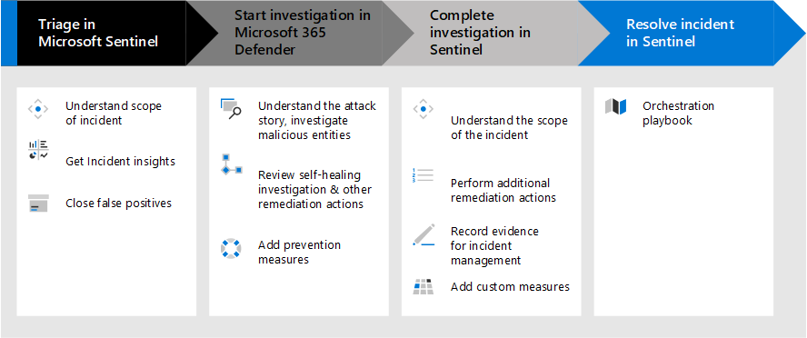
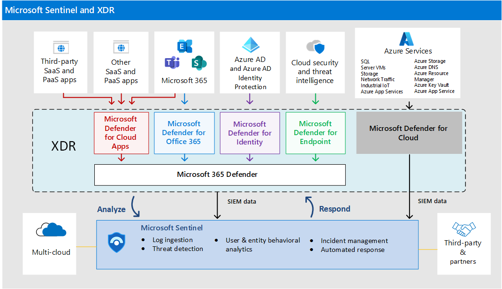

---
title: Implement Microsoft Sentinel and XDR for a Zero Trust approach
description: Implement Microsoft Sentinel and XDR for a Zero Trust approach
ms.author: macapara
author: mjcaparas
localization_priority: Normal
manager: dansimp
ms.topic: article
ms.service: microsoft-365-security
---

# Implement Microsoft Sentinel and XDR for a Zero Trust approach

This solution guide walks through the process of setting up Microsoft XDR tools together with Microsoft Sentinel to accelerate your organization’s ability to respond to and remediate cybersecurity attacks. 

This guidance walks through the process of responding to a incident, starting with discovery and triage in Microsoft Sentinel.  

With Microsoft Sentinel you can connect to any of the security sources using built-in connectors and industry standards. With its artificial intelligence you can correlate multiple low fidelity signals spanning multiple sources to create a complete view of ransomware kill chain and prioritized alerts. 

Microsoft 365 Defender is an extended detection and response (XDR) solution that complements Microsoft Sentinel. An XDR pulls raw telemetry data from across multiple tools like cloud applications, email security, identity, and access management. 

Using AI and machine learning, the XDR then performs automatic analysis, investigation, and response in real time. The XDR solution also correlates security alerts into larger incidents, providing security teams greater visibility into attacks, and provides incident prioritization, helping analysts understand the risk level of the threat. 

This guidance helps you mature your Zero Trust architecture by mapping the principles of Zero Trust in the following ways.    

|       Zero Trust Principle         |                                                                                                                                                                                                                                                                                                            Met by                                                                                                                                                                                                                                                                                                          |
|------------------------------------|:--------------------------------------------------------------------------------------------------------------------------------------------------------------------------------------------------------------------------------------------------------------------------------------------------------------------------------------------------------------------------------------------------------------------------------------------------------------------------------------------------------------------------------------------------------------------------------------------------------------------------|
|     Verify explicitly              |   Sentinel - Collects data from across the environment, performs analysis of threats and anomalies, and can respond with automation.    Microsoft 365 Defender - Provides extended detection and response across users, identities, devices, apps, and emails.  Risk-based signals captured by Microsoft  365 Defender can be used by Sentinel to take actions.                                                                                                                                                                                                                                                           |
|     Use least privileged access    |   Threat Intelligence with Sentinel - Sentinel can import threat intelligence data from Microsoft or third-party providers to detect new, emerging threats and provide extra context for investigations.    Microsoft 365 Defender has Azure Active Directory Identity Protection  which can block users based on the level of risk with identity.  Data can be fed into Sentinel for further analysis and automation.                                                                                                                                                                                                    |
|     Assume breach                  |   Microsoft 365 Defender continuously scans the environment for threats and vulnerabilities.       Sentinel analyzes collected data, behavioral trend of entities to detect suspicious activity, anomalies and multi-stage threats across enterprise.   Sentinel has workbook visualizations that can help organizations harden the environment, such as: Zero Trust workbook.   Microsoft 365 Defender and Sentinel can implement automated remediation tasks, including automated investigations, device isolation, and data quarantine. Device risk can be used as a signal to feed into Conditional Access.    |

## Reference architecture

In this diagram:

Signals feed into Microsoft 365 Defender and Microsoft Defender for Cloud.  Microsoft 365 Defender provides XDR capabilities for end-user environments (email, documents, identity, apps, and endpoint); and Microsoft Defender for Cloud provides XDR capabilities for infrastructure and multi-cloud platforms including virtual machines, databases, containers, and IoT. Microsoft 365 Defender and Microsoft Defender for Cloud send SIEM log data through a series of Microsoft Sentinel connectors. Microsoft Sentinel is a cloud-native SIEM tool that can can work with multi-cloud environments and integrate with third-party and partner platforms, helping secops teams analyze and respond to threats.

## Key capabilities
To implement a Zero trust approach in managing incidents, use these Microsoft Sentinel and XDR features.

Capability or feature | Description 
:---|:---
 |[Automated Investigation & Response (AIR)](/microsoft-365/security/defender-endpoint/automated-investigations) | AIR capabilities are designed to examine alerts and take immediate action to resolve breaches. AIR capabilities significantly reduce alert volume, allowing security operations to focus on more sophisticated threats and other high-value initiatives.  
 |[Advanced hunting](/microsoft-365/security/defender/advanced-hunting-overview) |Advanced hunting is a query-based threat hunting tool that lets you explore up to 30 days of raw data. You can proactively inspect events in your network to locate threat indicators and entities. The flexible access to data enables unconstrained hunting for both known and potential threats. 
|[Custom file indicators](/microsoft-365/security/defender-endpoint/indicator-file) | Prevent further propagation of an attack in your organization by banning potentially malicious files or suspected malware. 
|[Custom network indicators](/microsoft-365/security/defender-endpoint/indicator-ip-domain)|By creating indicators for IPs and URLs or domains, you can now allow or block IPs, URLs, or domains based on your own threat intelligence. 
|[EDR Block](/microsoft-365/security/defender-endpoint/edr-in-block-mode) | Provides added protection from malicious artifacts when Microsoft Defender Antivirus(MDAV) is not the primary antivirus product and is running in passive mode. EDR in block mode works behind the scenes to remediate malicious artifacts that were detected by EDR capabilities. 
| [Device response capabilities](/microsoft-365/security/defender-endpoint/respond-machine-alerts) | Quickly respond to detected attacks by isolating devices or collecting an investigation package
| [Live response](/microsoft-365/security/defender-endpoint/live-response) |Live response gives security operations teams instantaneous access to a device (also referred to as a machine) using a remote shell connection. This gives you the power to do in-depth investigative work and take immediate response actions to promptly contain identified threats in real time. 
|[Vulnerability management](/microsoft-365/security/defender-vulnerability-management/defender-vulnerability-management)| Leveraging Microsoft threat intelligence, breach likelihood predictions, business contexts, and devices assessments, Defender Vulnerability Management rapidly and continuously prioritizes the biggest vulnerabilities on your most critical assets and provides security recommendations to mitigate risk. 
| [User and Entity Behavioral Analytics (UEBA)](/azure/sentinel/enable-entity-behavior-analytics) |Analyzes behavior of an organization entities (such as users, hosts, iP Addresses, applications) 
| [Fusion](/azure/sentinel/configure-fusion-rules) |A correlation engine based on scalable machine learning algorithms, to automatically detect multistage attacks (also known as advanced persistent threats or APT) by identifying combinations of anomalous behaviors and suspicious activities that are observed at various stages of the kill chain.  
|[Threat Intelligence](/azure/sentinel/threat-intelligence-integration)  |Use Microsoft third-party providers to enrich data to provide extra context around activities, alerts, logs in your environment.  
| [Automation](/azure/sentinel/automation) |Automation rules are a way to centrally manage automation in Microsoft Sentinel, by allowing you to define and coordinate a small set of rules that can apply across different scenarios.  
|[Anomaly rules](/azure/sentinel/work-with-anomaly-rules)  |Anomaly rule templates use machine learning to detect specific types of anomalous behavior.  
|[Scheduled queries](/azure/sentinel/detect-threats-custom)  | Built-in rules written by Microsoft security experts that search through logs collected by Sentinel for suspicious activity chains, known threats. 
|[Near-real-time (NRT) rules](/azure/sentinel/create-nrt-rules)  | NRT rules are limited set of scheduled rules, designed to run once every minute, in order to supply you with information as up-to-the-minute as possible.  
|[Hunting](/azure/sentinel/hunting) | To help security analysts look proactively for new anomalies that weren't detected by your security apps or even by your scheduled analytics rules, Microsoft Sentinel's built-in hunting queries guide you into asking the right questions to find issues in the data you already have on your network. 
| [Microsoft 365 Defender Connector](/azure/sentinel/connect-microsoft-365-defender) | Microsoft 365 Defender Connector sync logs and incidents to Sentinel 
|[Data connectors](/azure/sentinel/connect-data-sources)  |Allow for the ingestion of data for analysis into sentinel  
|[Content hub solution -Zero Trust (TIC 3.0)](/azure/sentinel/sentinel-solution)   | Zero Trust (TIC 3.0)  includes a workbook, analytics rules, and a playbook, which provide an automated visualization of Zero Trust principles, cross-walked to the Trust Internet Connections framework, helping organizations to monitor configurations over time. 
|[Security Orchestration, Automation, and Response (SOAR) ](/azure/sentinel/sentinel-soar-content)  |Leverage automation rules and playbooks in response to security threats increases your SOC's effectiveness and saves you time and resources. 

## What's in this solution
This solution steps you through the implementation of Microsoft Sentinel and XDR so that your security operations team can effectively remediate incidents using a Zero Trust approach. 

## Learning for analysts

**[Connect Microsoft 365 Defender to Microsoft Sentinel](/training/modules/connect-microsoft-defender-365-to-azure-sentinel/)** 
Description:Learn about the configuration options and data provided by Microsoft Sentinel connectors for Microsoft 365 Defender. 
29 min - 8 units

> [!div class="nextstepaction"]
> [Start >](/training/modules/connect-microsoft-defender-365-to-azure-sentinel/)

## Next steps

Use these steps to implement Microsoft Sentinel and XDR for a Zero Trust approach:

1. [Set up your XDR tools](setup-xdr-tools.md)
2. [Architect a Sentinel workspace](siem-workspace.md)
3. [Ingest data sources](ingest-data-sources.md)
4. [Respond to an incident](respond-incident.md)