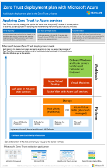

# Overview – Apply Zero Trust principles to Azure services

This series of articles help you apply the principles of Zero Trust to your services in Microsoft Azure using a multi-disciplinary approach to applying the Zero Trust principles. Zero Trust is a security strategy. It is not a product or a service, but an approach in designing and implementing the following set of security principles:

- Verify explicitly
- Use least privileged access
- Assume breach

Implementing the Zero Trust “never trust, always verify” mindset requires changes to cloud infrastructure, deployment strategy, and implementation.

These articles show you how to apply Zero Trust approach to these new or already deployed Azure services:

- [Azure IaaS overview](azure-infrastructure-overview.md)
  - [Azure storage](azure-infrastructure-storage.md)
  - [Virtual machines](azure-infrastructure-virtual-machines.md)
  - [Spoke virtual networks](azure-infrastructure-iaas.md)
  - [Hub virtual networks](azure-infrastructure-networking.md)
- [Azure Virtual Desktop](azure-infrastructure-avd.md)
- [Azure Virtual WAN](azure-virtual-wan.md)
- [IaaS applications in Amazon Web Services](secure-iaas-apps.md)
- [Microsoft Sentinel and Microsoft 365 Defender](/security/operations/siem-xdr-overview)

For more information about recommendations in your Cloud Adoption Framework and Azure landing zones, see these resources:

## Content architecture

Here is the content architecture for this set of articles that contain the set of platform and workload articles to apply Zero Trust principles to Azure services.

:::image type="content" source="media/apply-zero-trust-azure-services-overview/content-architecture.svg" alt-text="Diagram of the content architecture for applying Zero Trust to Azure services." lightbox="media/apply-zero-trust-azure-services-overview/content-architecture.svg":::

You apply the guidance in the articles in a stack from the bottom up. The articles don't need to be followed in the order indicated in all cases, but all of the platform articles should be implemented for the workload for Zero Trust-based protection.

| Workload | Platform set of articles |
| --- | --- |
| IaaS apps in Amazon Web Services (AWS) | Cloud identity infrastructure   Microsoft Sentinel and Microsoft 365 Defender |
| Azure Virtual Desktop | Cloud identity infrastructure   Microsoft Sentinel and Microsoft 365 Defender   Hub VNets (traditional) OR Azure Virtual WAN (Microsoft-managed)   Spoke VNets with Azure IaaS services   Storage |
| Virtual machines | Cloud identity infrastructure   Microsoft Sentinel and Microsoft 365 Defender   Hub VNets (traditional) OR Azure Virtual WAN (Microsoft-managed)   Spoke VNets with Azure IaaS services   Storage    Additionally, for Windows and Linux servers, onboard them to Microsoft Defender for Endpoint. |

It’s important to note that the guidance in this series of articles is more specific for this type of architecture than the guidance provided in the [Cloud Adoption Framework](/azure/cloud-adoption-framework/get-started/index) and [Azure landing zone](/azure/cloud-adoption-framework/ready/landing-zone/index) architectures. If you have applied the guidance in either of these resources, be sure to also review this series of articles for additional recommendations.  

## Next Steps

See these additional articles for applying Zero Trust principles to Azure services:

- For Azure IaaS:
  - [Azure storage](azure-infrastructure-storage.md)
  - [Virtual machines](azure-infrastructure-virtual-machines.md)
  - [Spoke virtual networks](azure-infrastructure-iaas.md)
  - [Hub virtual networks](azure-infrastructure-networking.md)
- [Azure Virtual Desktop](azure-infrastructure-avd.md)
- [Azure Virtual WAN](azure-virtual-wan.md)
- [IaaS applications in Amazon Web Services](secure-iaas-apps.md)
- [Microsoft Sentinel and Microsoft 365 Defender](/security/operations/siem-xdr-overview)

## Technical illustrations

This poster provides a single-page, at-a-glance view of the content architecture of applying the "never trust, always verify" principles of the Zero Trust to Azure services.

| Item | Related solution guides |
|:-----|:-----|
|   [PDF](https://microsoft.sharepoint-df.com/:u:/t/ZeroTrustAdvisoryV-Team/Eb5YW2wc2mVOvN6-pgj8hMsBT16-FdpybfnviQUEQaPMRQ?e=WVelVw) \| [Visio](https://microsoft.sharepoint-df.com/:u:/t/ZeroTrustAdvisoryV-Team/Eb5YW2wc2mVOvN6-pgj8hMsBT16-FdpybfnviQUEQaPMRQ?e=WVelVw)   Updated June 2023 | <ul><li>[Azure IaaS services](azure-infrastructure-overview.md)</li><li>[Azure Virtual Desktop](azure-infrastructure-avd.md)</li><li>[Azure Virtual WAN](azure-virtual-wan.md)</li><li>[IaaS applications in Amazon Web Services](secure-iaas-apps.md)</li><li>[Microsoft Sentinel and Microsoft 365 Defender](/security/operations/siem-xdr-overview)</li></ul>|

For additional technical illustrations, click [here](zero-trust-tech-illus.md).

## References

Refer to the links below to learn about the various services and technologies mentioned in this article.

- [What is Azure - Microsoft Cloud Services](https://azure.microsoft.com/resources/cloud-computing-dictionary/what-is-azure/)
- [Introduction to Azure security](/azure/security/fundamentals/overview)
- [Zero Trust implementation guidance](/security/zero-trust/zero-trust-overview)
- [Overview of the Microsoft cloud security benchmark](/security/benchmark/azure/overview)
- [Security baselines for Azure overview](/security/benchmark/azure/security-baselines-overview)
- [Building the first layer of defense with Azure security services](/azure/architecture/solution-ideas/articles/azure-security-build-first-layer-defense)
- [Microsoft Cybersecurity Reference Architectures](/security/cybersecurity-reference-architecture/mcra)
