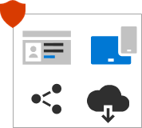

# Zero Trust Rapid Modernization Plan (RaMP)

Today’s organizations need a new security model that more effectively adapts to the complexity of the modern environment, embraces the hybrid workplace, and protects people, devices, apps, and data wherever they’re located. This new model includes:

- Productivity everywhere

  Empower your users to work more securely anywhere and anytime, on any device.

- Cloud migration

  Enable digital transformation with intelligent security for today’s complex environment.

- Risk mitigation

  Close security gaps and minimize risk of lateral movement.

Zero Trust operates on these security principles:

- Verify explicitly

  Always authenticate and authorize based on all available data points, including user identity, location, device health, service or workload, data classification, and anomalies.

- Use least privilege access

  Limit user access with just-in-time and just-enough-access (JIT/JEA), risk-based adaptive polices, and data protection to help secure both data and productivity.

- Assume breach

  Minimize blast radius and segment access. Verify end-to-end encryption and use analytics to get visibility, drive threat detection, and improve defenses.

Here is the overall architecture for Zero Trust.

:::image type="content" source="./media/zero-trust-ramp-overview/zero-trust-architecture.png" alt-text="The overall architecture for Zero Trust" lightbox="./media/zero-trust-ramp-overview/zero-trust-architecture.png":::

## RaMP initiatives for Zero Trust

The guidance for deployment of Zero Trust in your organization is organized in main initiatives.

| Initiative | Steps |
|:-------|:-----|
| **Top priorities** | Critical security modernization initiatives: |
|    [User access and productivity](user-access-productivity-overview.md) | <ol><li>[Explicitly validate trust for all access requests](user-access-productivity-validate-trust.md) <ul><li>[Identities](user-access-productivity-validate-trust.md#identities)</li><li>[Endpoints (devices)](user-access-productivity-validate-trust.md#endpoints)</li><li>[Apps](user-access-productivity-validate-trust.md#apps)</li><li>[Network](user-access-productivity-validate-trust.md#network)</li></ul></li> |
|    [Data, compliance, and governance](data-compliance-governance-overview.md) | <ol start="2"><li>[Ransomware recovery readiness](data-compliance-gov-ransomware-recovery-readiness.md) </li><li>[Data](data-compliance-gov-data.md) </ol> |
|    [Modernize security operations](modernize-security-operations-overview.md)  | <ol start="4"><li>[Streamline response](modernize-security-operations-streamline-response.md)</li><li>[Unify visibility](modernize-security-operations-unify-visibility.md)</li><li>[Reduce manual effort](modernize-security-operations-reduce-manual-effort.md)</li></li></ol>|
| **As needed** | Additional initiatives based on Operational Technology (OT) or IoT usage, on-premises and cloud adoption, and security for in-house app development: |
|    OT and Industrial IoT | <ul><li>Discover</li><li>Protect</li><li>Monitor</li></ul> |
|    Datacenter & DevOps Security | <ul><li>Security Hygiene</li><li>Reduce Legacy Risk</li><li>DevOps Integration</li><li>Microsegmentation</li></ul> |

<!--

User Access and Productivity

<ol><li>Explicitly validate trust for all access requests <ul><li>User Accounts</li><li>Devices</li></ul></li><li>Increase security for accessing key resources <ul><li>Apps</li><li>Data</li></ul><li>Governance</li></ol>

Modernize Security Operations

<ol start="4"><li>Streamine response</li><li>Unify visibility</li><li>Reduce manual effort</li></li></ol>

Operational Technology (OT) and Industrial IoT

<ul><li>Discover</li><li>Protect</li><li>Monitor</li></ul>

SLIDE GRAPHIC=========================================================

The guidance for deployment of Zero Trust in your organization is organized in main areas.

For every organization, the top priority Zero Trust RaAMP initiatives are:

- [User access and productivity](user-access-productivity-overview.md)
- [Data, compliance, and governance](data-compliance-governance-overview.md)
- [Modernize security operations](modernize-security-operations-overview.md)

Zero Trust RaMP initiatives based on need for the use of Operations Technology (OT) and Industrial IoT, on-premises and cloud adoption, and security for in-house app development are:

- OT and industrial IoT
- Datacenter & DevOps security

--> 

## Next step

Begin your Zero Trust RaMP deployment journey with [User access and productivity](user-access-productivity-overview.md).
